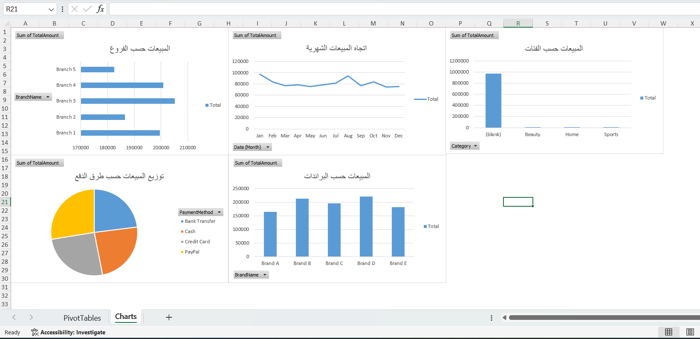
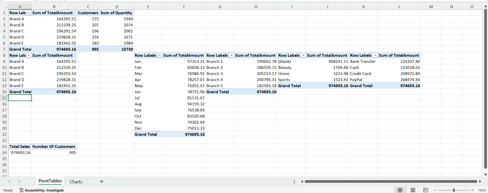

# Sales Analysis Dashboard

## Overview
This Excel project delivers an end-to-end sales analytics solution designed to transform raw sales data into actionable business insights. The project leverages Power Query for data cleaning and transformation, Power Pivot for data modeling and relationship management, and DAX for creating calculated measures and KPIs.

An interactive dashboard was developed to analyze sales performance across branches, product categories, brands, and time periods, enabling stakeholders to make informed, data-driven decisions.

---

## Project Objectives
- Clean and transform raw sales data for analysis.
- Build a structured data model using Power Pivot.
- Create key performance indicators (KPIs) using DAX.
- Analyze sales performance across multiple business dimensions.
- Design an interactive dashboard to support business decision-making.

---

## Tools & Technologies
- **Microsoft Excel**
- **Power Query**
- **Power Pivot**
- **DAX (Data Analysis Expressions)**
- **Pivot Tables**
- **Pivot Charts**
- **Interactive Dashboard Design**

---

## Dashboard Features

### Key Performance Indicators (KPIs)
- Total Sales
- Total Orders
- Average Sales
- Sales Growth Trends

### Analysis Areas
- Sales by Branch
- Sales by Product Category
- Sales by Brand
- Monthly and Yearly Sales Trends
- Product Performance Analysis
- Revenue Distribution

### Interactive Features
- Slicers and Filters
- Dynamic Pivot Tables
- Interactive Charts
- Drill-Down Analysis

---

## Data Preparation

The dataset was prepared using Power Query through the following steps:

- Data Cleaning and Validation
- Handling Missing Values
- Data Type Formatting
- Removing Duplicates
- Data Transformation
- Creating Business-Friendly Data Structures

---

## Data Modeling

Power Pivot was used to create a relational data model by:

- Establishing relationships between tables
- Creating calculated columns
- Developing DAX measures
- Optimizing data for reporting and analysis

---

## Key Insights

The dashboard helps answer important business questions such as:

- Which branches generate the highest sales?
- Which product categories contribute most to revenue?
- What are the top-performing brands?
- How do sales fluctuate over time?
- What trends can be identified to improve business performance?

---

## Dashboard Preview

---
## Pivot Tables Preview

---

## Skills Demonstrated

- Data Cleaning & Transformation
- Power Query
- Data Modeling
- Power Pivot
- DAX Calculations
- Pivot Tables & Pivot Charts
- Dashboard Development
- Business Intelligence
- Sales Analytics
- Data Visualization

---

## Business Value

This dashboard provides business stakeholders with a centralized view of sales performance, enabling them to monitor key metrics, identify trends, evaluate product and branch performance, and make strategic decisions based on data.

---

## Author

**Ahmad Abdallah**

Data Analyst | Business Intelligence Analyst

### Connect with Me
- GitHub: https://github.com/AhmadAbdallahMujahid?tab=repositories
- LinkedIn: https://www.linkedin.com/in/ahmad-abdallah-9662942a0/?skipRedirect=true

---

## Project Highlights

✔ Data Cleaning with Power Query 
✔ Data Modeling with Power Pivot 
✔ DAX Measures and KPIs 
✔ Interactive Sales Dashboard 
✔ Multi-Dimensional Sales Analysis 
✔ Business Intelligence Reporting
